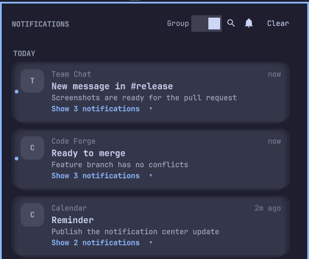
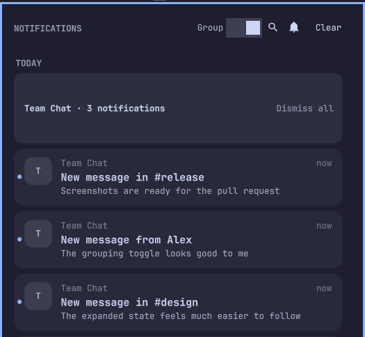

# Notification Center

An [Omarchy](https://omarchy.org) bar widget that keeps the notifications you
were sent. A bell on the right of the bar, a dot on it when something has come
in, and a panel of everything you were told, still there tomorrow.

Omarchy shows a notification once. This answers the question that comes ten
minutes later, in the middle of something else: *what did that say?*


## Grouped notifications

Notifications from the same app can collapse into one stack. Click the stack
to expand it in place, dismiss individual notifications without losing your
position, or use **Dismiss all** for the whole group. The header switch changes
between grouped and individual notifications immediately.

<p>
  
  
</p>

## Install

```bash
omarchy plugin add https://github.com/jankeesvw/omarchy-notification-center.git --enable
```

Needs `jq` and `inotifywait`, both of which Omarchy already has. Leave the bell
at the far right of the bar: the panel is pinned to the right edge of the
screen, so a bell in the middle is a bell whose panel opens somewhere else.

## What it does

Omarchy's notification service already writes every notification to disk, and
then keeps only the last ten. This copies each one out of there as it lands,
icon and all, and keeps it for 30 days.

- Notifications from the same app stack together within each day. A stack
  opens inline; search results remain individual.
- **A picture** when there was one. Cameras and screenshot tools hand their
  file to the notification's action rather than setting an image on it, so the
  path is read out of there and a scaled copy is kept.
- **Clicking a card** opens that picture, or focuses the app that sent the
  notification. It never runs the command the notification arrived with: that
  command is chosen by whoever sent the notification, so a stored one would be
  an attacker's command waiting for a click. Only an absolute path to an image
  is kept, and it is opened by argument rather than through a shell.
- **The × on a card**, or a right-click, removes one. A collapsed stack removes
  only its newest item; open it for individual items or **Dismiss all**. **Clear**
  empties the archive and asks twice.
- **The bell in the header** is Do Not Disturb, the same switch as the bar's.
  Right-clicking the bell in the bar does it without opening anything.
- **The magnifier**, or `/`, searches everything kept. Escape leaves the
  search, Escape again closes the panel.
- **The Group switch** in the header immediately changes between app stacks
  and individual notifications. The grouping style remains available in the
  plugin settings.

## Settings

| Setting | Default | |
| --- | --- | --- |
| Mark what you have not read | Dot | `Dot`, `Count` or `None` on the bell. |
| Keep notifications for | 30 days | Older than this is deleted, icon and all. |
| Keep at most | 1000 | A ceiling regardless of age. |
| Clicking a notification | Auto | Opens the picture, or focuses the app. Or neither. |
| Group notifications | By app | `Off`, `Similar` (same app and subject), or `By app`. |
| Show the message text | on | Off leaves the sender and subject only. |
| Show pictures | on | Off stops keeping copies as well. |
| Panel width | 420 | In the shell's spacing units. |
| List height | 0 | 0 runs the list to the bottom of the screen. |

## Where things are kept

`~/.local/state/omarchy-notification-center/`, one line of JSON per
notification plus a copy of every icon and picture. The directory is `0700`
and the archive `0600`, and only files that are actually images are copied
into it.

Worth knowing for one reason: **that is every notification you have been sent**,
chat messages and two-factor codes included. It never leaves the machine, but
it is not something to sync or back up carelessly. `Keep notifications for` is
the setting that limits the damage, and one day is a perfectly reasonable
answer to it.

Removing the plugin leaves the archive alone, on purpose:

```bash
omarchy plugin remove jankeesvw.notification-center
rm -rf ~/.local/state/omarchy-notification-center
```

## The command line

`bin/notification-center` is the storage side, and how you search further back
than the panel loads:

```
list [LIMIT]       the archive as JSON, newest first
remove KEY [...]   drop one or more
seed [N]           fill it with test traffic
backfill           give older entries the picture their action points at
```

`watch`, `sync`, `seen`, `unread` and `prune` are in there too; everything
prints JSON.

```bash
# everything Slack sent you last week, as text
notification-center list 2000 | jq -r '.[] | select(.app == "Slack") | "\(.summary): \(.body)"'
```

The panel opens over IPC, which is how you bind it to a key:

```bash
omarchy-shell jankeesvw.notification-center toggle
```

## Licence

MIT.
